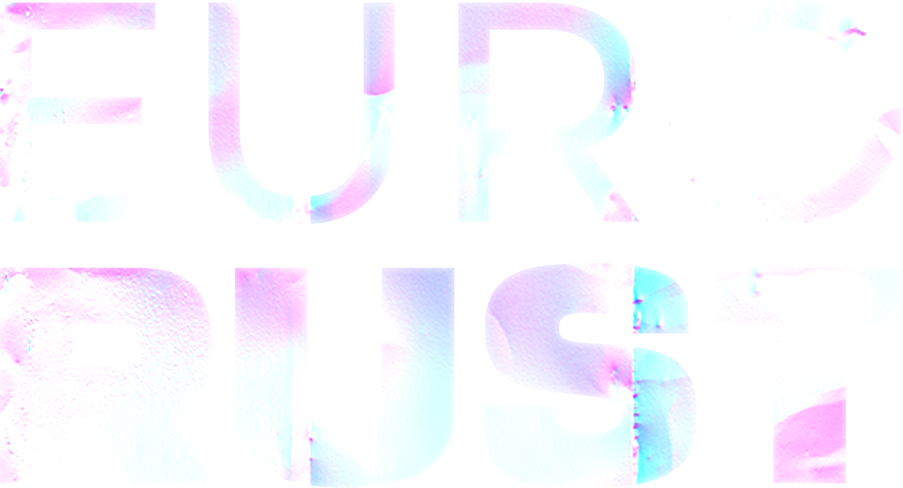

# eurorust.eu

The source code for [https://eurorust.eu](https://eurorust.eu).



## Installation

- `git clone <repository-url>` this repository
- `zola build`

### Install Zola

[Zola](https://www.getzola.org) provides pre-built binaries for MacOS, Linux, and Windows.

You can visit their documentation page to see [install options](https://www.getzola.org/documentation/getting-started/installation/).

## Running / Development

- `zola serve` (Rebuild and reload on change automatically)
- open [http://localhost:1111](http://localhost:1111).

### Docker

To run the app via Docker, use the included setup with

```bash
docker compose up
```

### Deployment

We use Netlify to deploy the website.

[](https://app.netlify.com/sites/startling-centaur-29ca5a/deploys)

## Copyright

Copyright &copy; 2024 Events Matter UG, released under the
[Creative Commons Attribution-NonCommercial 4.0 International license](https://creativecommons.org/licenses/by-nc/4.0/).
